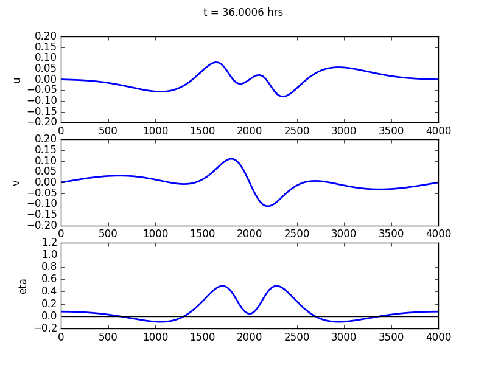
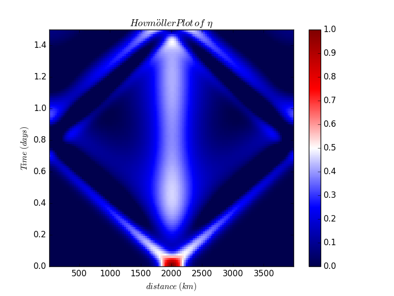

Examples
========

Geostrophic Adjustment: One-Dimension
-------------------------------------

In the directory ``examples`` you will find an example entitled
``example_1D_geoadjust.py``

First, libraries are imported. Two standard ones are numpy, for
calculations, and matplotlib.pyplot for plotting. Those are standard to
numpy. Then, there are four other things that are imported:

-  **Steppers** This contains different time-stepping functions. At the
   moment we have Euler, Adams-Bashforth 2 (AB2), Adams-Bashforth 3
   (AB3) and Runge-Kutta 4 (RK4). PyRsw uses adaptive time stepping to
   try and be more efficient in how the solution is marched forward.

-  **Fluxes** This contains the fluxes for the RSW model. At the moment
   there is only the option for a pseudo-spectral model but this will be
   generalized to include a Finite Volume method as well.

-  **PyRsw** This is the main library and importing Simulation imports
   the core of the library.

-  **constants** This has some useful constants, more can be added if
   desired.

After the libraries are imported then a simulation object is created.

::

    sim = Simulation()

Below specifies the geometry in :math:`x` and :math:`y`: [Options
’periodic’, ’walls’]

We use AB3, a spectral method: [Options: Euler, AB2, AB3, RK4]

We solve the nonlinear dynamics: [Options: Linear and Nonlinear]

Use spectral sw model (no other choices at present).

::

    sim.geomy       = 'periodic'
    sim.stepper     = Step.AB3       
    sim.method      = 'Spectral'       
    sim.dynamics    = 'Nonlinear'    
    sim.flux_method = Flux.spectral_sw

We specify a lot of parameters. There are some default values that are
specified in PyRsw.

::

    sim.Ly  = 4000e3            # Domain extent               (m)
    sim.Nx  = 1                 # Grid points in x
    sim.Ny  = 128               # Grid points in y
    sim.Nz  = 1                 # Number of layers
    sim.g   = 9.81              # Gravity                     (m/sec^2)
    sim.f0  = 1.e-4             # Coriolis                    (1/sec)
    sim.beta = 0e-10            # Coriolis beta parameter     (1/m/sec)
    sim.cfl = 0.05              # CFL coefficient             (m)
    sim.Hs  = [100.]            # Vector of mean layer depths (m)
    sim.rho = [1025.]           # Vector of layer densities   (kg/m^3)
    sim.end_time = 2*24.*hour   # End Time                    (sec)

There is an option to thread the FFTW’s if using pyfftw.

::

    sim.num_threads = 4

Below we specify the plotting interval, what kind of plotting to do, and
the limits on the three figures.

::

    sim.plott   = 20.*minute  # Period of plots
    sim.animate = 'Anim'      # 'Save' to create video frames,
                              # 'Anim' to animate,
                              # 'None' otherwise
    sim.ylims=[[-0.18,0.18],[-0.18,0.18],[-0.5,1.0]]

We can specify the periodicity of plotting and whether we want a life
animation or make a video. More on this this later.

::

    sim.output = False        # True or False
    sim.savet  = 1.*hour      # Time between saves

Specify periodicity of diagnostics and whether to compute them. This is
not tested.

::

    sim.diagt    = 2.*minute  # Time for output
    sim.diagnose = False      # True or False

Initialize the simulation.

::

    sim.initialize()

Specify the initial conditions. There is an option whether we want the
domain in :math:`x` or :math:`y`. At the moment there is no difference
because there is no :math:`\beta`-plane but this will be added.

::

    for ii in range(sim.Nz):  # Set mean depths
        sim.soln.h[:,:,ii] = sim.Hs[ii]

    # Gaussian initial conditions
    x0 = 1.*sim.Lx/2.         # Centre
    W  = 200.e3               # Width
    amp = 1.                  # Amplitude
    sim.soln.h[:,:,0] += amp*np.exp(-(sim.Y)**2/(W**2))

Solve the problem.

::

    sim.run()             

Plot the Hovmöller diagram in time versus space.

::

    # Hovmuller plot
    plt.figure()
    t = np.arange(0,sim.end_time+sim.plott,sim.plott)/86400.

    if sim.Ny==1:
        x = sim.x/1e3
    elif sim.Nx == 1:
        x = sim.y/1e3

    for L in range(sim.Nz):
        field = sim.hov_h[:,0,:].T - np.sum(sim.Hs[L:])
        cv = np.max(np.abs(field.ravel()))
        plt.subplot(sim.Nz,1,L+1)
        plt.pcolormesh(x,t, field,
            cmap=sim.cmap, vmin = -cv, vmax = cv)
        plt.axis('tight')
        plt.title(r"$\mathrm{Hovm{\"o}ller} \; \mathrm{Plot} \; \mathrm{of} \; \eta$", fontsize = 16)
        if sim.Nx > 1:
            plt.xlabel(r"$\mathrm{x} \; \mathrm{(km)}$", fontsize=14)
        else:
            plt.xlabel(r"$\mathrm{y} \; \mathrm{(km)}$", fontsize=14)
        plt.ylabel(r"$\mathrm{Time} \; \mathrm{(days)}$", fontsize=14)
        plt.colorbar()

    plt.show()

   Final solution for the test case.

   Hovmöller plot for the test case.
Note that to compute the derivatives in the case of a non-periodic
domain we impose either Dirichlet or Neumann boundary conditions. This
is done by doing odd and even extensions respectively. That is why in
1D, the simulation with walls does twice as much work as in the periodic
case. Similarly, if we have walls in 2D, that is doing four times as
much work.

At some point we should change walls to ’slip’ and allow for ’noslip’
boundary conditions as well.

Geostrophic Adjustment: 2D
--------------------------

The basic script is almost identical to the 1D case and can be found in
the examples folder with the title example\_2D\_geoadjust.py. The
changes are as follows:

-  Set :math:`Nx` and :math:`Ny` both equal to :math:`128`, and from
   this we build a 2D grid.

-  Specify the length of the domain in the zonal direction.

-  Define the initial conditions on a 2D grid.

-  The plotting is different. We plot a 2D field using pcolormesh and we
   don’t do a Hovmöller plot.

Bickley Jet: 2D and 1L
----------------------

Following Poulin and Flierl (2003) and Irwin and Poulin (2014), we look
at the instability of a Bickley jet. The script is called
example\_2D\_BickleyJet.py.

In this case we change the code to include the following lines.

::

    # Define geometry
    sim.geomx       = 'periodic'
    sim.geomy       = 'walls'

    # Define grid and domain size
    sim.Lx  = 200e3          # Domain extent               (m)
    sim.Ly  = 200e3          # Domain extent               (m)
    sim.Nx  = 128            # Grid points in x
    sim.Ny  = 128            # Grid points in y

    # Bickley Jet initial conditions
    # First we define the jet
    Ljet = 20e3            # Jet width
    amp  = 0.1             # Elevation of free-surface in basic state
    sim.soln.h[:,:,0] += -amp*np.tanh(sim.Y/Ljet)
    sim.soln.u[:,:,0]  =  sim.g*amp/(sim.f0*Ljet)/(np.cosh(sim.Y/Ljet)**2)
    # Then we add on a random perturbation
    sim.soln.u[:,:,0] +=  2e-3*np.exp(-(sim.Y/Ljet)**2)*np.random.randn(sim.Nx,sim.Ny)

