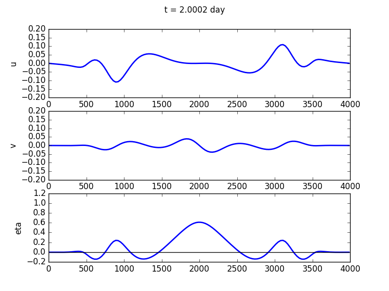
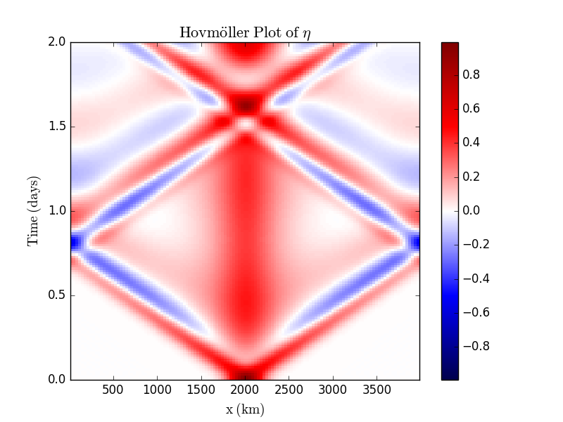

Examples
========

Geostrophic Adjustment: 1D and 1L
---------------------------------

In the directory ``src`` you will find an example entitled
``example_1D_1L_spectral.py``

First, libraries are imported. Two standard ones are numpy, for
calculations, and matplotlib.pyplot for plotting. Those are standard to
numpy. Then, there are four other things that are imported:

-  **Steppers** This contains different time-stepping functions. At the
   moment we have Euler, Adams-Bashforth 2 (AB2) and Runge-Kutta 4
   (RK4). PyRsw uses adaptive time stepping to try and be more efficient
   in how the solution is marched forward.

-  **Fluxes** This contains the fluxes for the RSW model. At the moment
   there is only the option for a pseudo-spectral model but this will be
   generalized to include a Finite Volume method as well.

-  **PyRsw** This is the main library and importing Simulation imports
   the core of the library.

-  **constants** This has some useful constants, more can be added if
   desired.

After the libraries are imported then a simulation object is created.

::

    sim = Simulation()

Below specifies the geometry in :math:`x` and :math:`y`: [Options
’periodic’, ’walls’]

We use AB2, a spectral method: [Options: Euler, AB2, RK4]

We solve the nonlinear dynamics (can be Linear)

Use spectral sw model (no other choices). Maybe hide this.

::

    sim.geomx       = 'walls'            
    sim.geomy       = 'periodic'
    sim.stepper     = Step.AB2       
    sim.method      = 'Spectral'       
    sim.dynamics    = 'Nonlinear'    
    sim.flux_method = Flux.spectral_sw

We specify a lot of parameters. There are some default values that are
specified in PyRsw.

::

    sim.Lx  = 4000e3          # Domain extent               (m)
    sim.Ly  = 4000e3          # Domain extent               (m)
    sim.geomx = 'periodic'    # Boundary Conditions
    sim.geomy = 'periodic'    # Boundary Conditions
    sim.Nx  = 128             # Grid points in x
    sim.Ny  = 1               # Grid points in y
    sim.Nz  = 1               # Number of layers
    sim.g   = 9.81            # Gravity                     (m/sec^2)
    sim.f0  = 1.e-4           # Coriolis                    (1/sec)
    sim.cfl = 0.05            # CFL coefficient             (m)
    sim.Hs  = [100.]          # Vector of mean layer depths (m)
    sim.rho = [1025.]         # Vector of layer densities   (kg/m^3)
    sim.end_time = 36.*hour   # End Time                    (sec)

We can specify the periodicity of plotting and whether we want a life
animation or make a video. More on this this later.

::

    sim.output = False        # True or False
    sim.savet  = 1.*hour      # Time between saves

Specify periodicity of diagnostics and whether to compute them. This is
not tested.

::

    sim.diagt    = 2.*minute  # Time for output
    sim.diagnose = False      # True or False

Initialize the simulation.

::

    sim.initialize()

Specify the initial conditions. There is an option whether we want the
domain in :math:`x` or :math:`y`. At the moment there is no difference
because there is no :math:`\beta`-plane but this will be added.

::

    for ii in range(sim.Nz):  # Set mean depths
        sim.soln.h[:,:,ii] = sim.Hs[ii]

    # Gaussian initial conditions
    x0 = 1.*sim.Lx/2.      # Centre
    W  = 200.e3                # Width
    amp = 1.                  # Amplitude
    if sim.Ny==1:
        sim.soln.h[:,:,0] += amp*np.exp(-(sim.x-x0)**2/(W**2)).reshape((sim.Nx,1))
    elif sim.Nx==1:
        sim.soln.h[:,:,0] += amp*np.exp(-(sim.y-x0)**2/(W**2)).reshape((1,sim.Ny))

Solve the problem.

::

    sim.run()             

Plot the Hovmöller diagram in time versus space.

::

    if sim.Ny==1:
        plt.figure               
        t = np.arange(0,sim.end_time+sim.plott,sim.plott)/86400.
            
        for L in range(sim.Nz):
            field = sim.hov_h[:,0,:].T - np.sum(sim.Hs[L:])
            plt.subplot(sim.Nz,1,L+1)
            plt.pcolormesh(sim.x/1e3,t, field,
                cmap=sim.cmap, vmin = 0, vmax = amp)
            plt.xlim([sim.x[0]/1e3, sim.x[-1]/1e3])
            plt.ylim([t[0], t[-1]])
            plt.title(r"$Hovm{\"o}ller Plot\, {of} \,\, \eta$")
            plt.xlabel(r"$distance \, \, (km)$")
            plt.ylabel(r"$Time \, \, (days)$")
            plt.colorbar()
        plt.show()

   Final solution for the test case.

   Hovmöller plot for the test case.
There is a second example called example\_1D\_geoadjust2.py that begins
with a hyperbolic tangent profile instead if a Gaussian initial
condition.

Geostrophic Adjustment: 2D and 1L
---------------------------------

The basic script is almost identical to the 1D case. The changes are as
follows:

-  Set :math:`Nx` and :math:`Ny` both equal to :math:`128`, and from
   this we build a 2D grid.

-  Define the initial conditions on a 2D grid.

-  The plotting is different. We plot a 2D field using and we don’t do a
   Hovmöller plot.

Bickley Jet: 2D and 1L
----------------------

Following Poulin and Flierl (2003) and Irwin and Poulin (2014), we look
at the instability of a jet.
